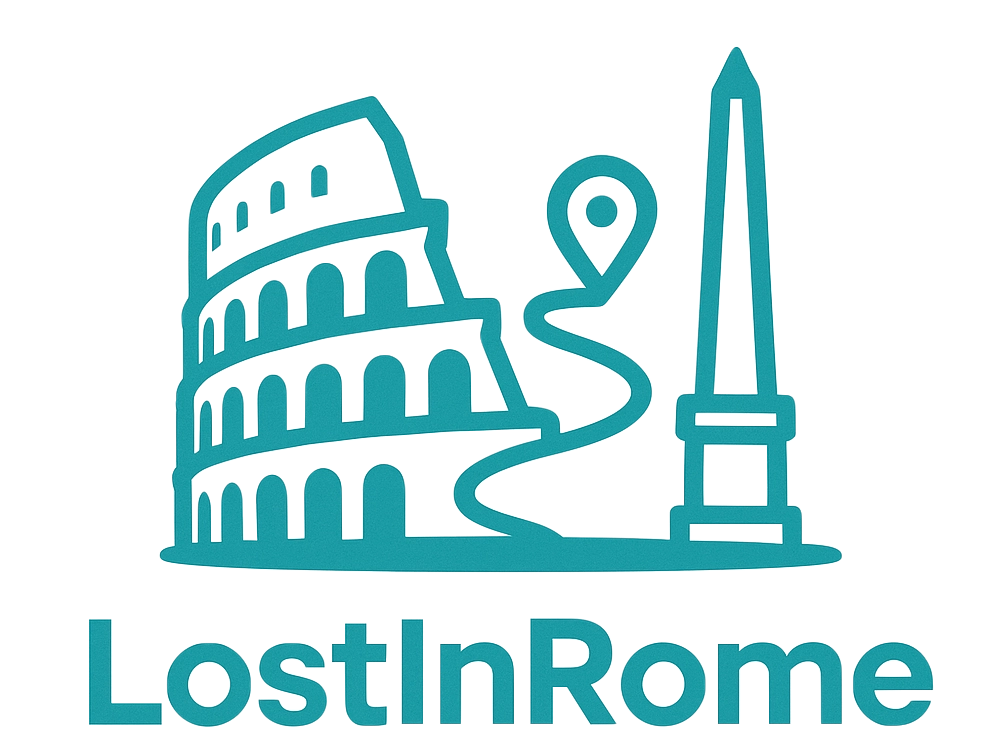

# Software Requirements Specification (SRS) [link al GoogleDoc](https://docs.google.com/document/d/1vZeSWB2j1AxRaS60J09652LO0gDZCkJkbwvGzQtmzkE/edit?usp=sharing)
for

# [**LostInRome**](https://lostinrome.netlify.app/)   

                                                             una guida bilingue per chi si perde nei vicoli di Roma
							   
[visita il sito](https://lostinrome.netlify.app/)

Prepared by _**Alfandari Jacopo**_

 
**Data ultima modifica:** 16/09/2025

# Cronologia versioni SRS

| Version  | Data Ultima modifica | Autore     |   Stato    |  Modifica                                         |
|----------|----------------------|------------|----------- |-------------------------------------------------- |
| v1.0     | 27/03/2025           | JAlfandari |Approved ☑️ |first release										|
| v1.1     | 31/03/2025           | JAlfandari |Approved ☑️ |Add functionality e mockup							|
| v1.2     | 27/04/2025           | JAlfandari |Approved ☑️ |Add Itinerary Section								|
| v1.3     | 16/09/2025           | JAlfandari |Approved ☑️ |Add Modulo IoT Monitoraggio dati ambientali e Quiz  |

# Introduzione
# Descrizione generale (Purpose)
Il sito è una guida turistica digitale in italiano e inglese che presenta 6 monumenti iconici di Roma:

- Piazza del Popolo e Basiliche gemelle 
- Altare della Patria 
- Ara Pacis 
- Pantheon 
- Piazza di Spagna 
- Fontana di Trevi 

# Caratteristiche principali 

✅ Solo consultazione (nessuna interazione complessa)  
🌍 Bilingue (italiano/inglese) con switch tramite bandiere  
🗺️ Mappe integrate (Google Maps) per ogni monumento  
📱 Design responsive (mobile-first)  

Priorità lingua: Impostare l’italiano come lingua predefinita.

Per il momento non sono previste funzionalità di registrazione e autenticazione utente, né altre funzionalità di backend.  Da considerarsi come sviluppi futuri.

# Requisiti Funzionali (RF)
Segue una descrizione dettagliata di tutti i requisiti che dovranno essere rispettati nell’implementazione delle pagine del sito web.

# Requisiti Funzionali Globali (di tutte le pagine)
Tutte le pagine web da sviluppare dovranno avere i seguenti requisiti.
# RF-0: Switch lingua (IT/EN) 

Ogni pagina dovrà avere un’icona a forma di bandiera (🇮🇹/🇬🇧) per lo switch di lingua (da IT a EN e da EN a IT).

Esempio:

- pagina in IT deve avere bandiera 🇬🇧 che rimanda alla pagina in EN
- pagina in EN deve avere bandiera 🇮🇹 che rimanda alla pagina in IT

# RF-1: Link alla HomePage della stessa lingua 
Ogni pagina dovrà avere un’icona a forma di casa (🏠) che rimanda alla homePage nella stessa lingua

Esempio: 
 - pagina in IT → clicco sull’icona homePage 🏠 → homePage in IT

# Stile comune a tutte le pagine 
Ogni pagina dovrà avere lo stesso stile. 

Segue un’immagine delle varie sezioni di una pagina web.

# RF-2: Header (con navbar) comune a tutte le pagine
Ogni pagina dovrà avere lo stesso stile per l’header.
# RF-3: Footer comune a tutte le pagine
Ogni pagina dovrà avere lo stesso stile per il footer.

# RF-4: Contenuto comune a tutte le pagine
Ogni pagina dovrà avere lo stesso stile per il contenuto. 

- 🛠️ **TODO**: INSERIRE MOCKUP 

# RF-5: Navigazione responsive

 Ogni pagina dovrà adattarsi perfettamente alla dimensione di qualsiasi schermo (mobile, tablet, desktop) garantendo una user-experience ottimale.

# Requisiti Funzionali Singole Pagine
     Le singole pagine web da sviluppare dovranno avere i seguenti requisiti.
     
# RF-6: Home pages in lingua (IT/EN) 
- La home page di default dovrà essere quella in IT.
- La home page dovrà contenere una galleria di sei immagini scorrevoli visualizzabili a gruppi di tre.
  
- Le immagini della galleria dovranno:
	- rappresentare i sei monumenti 
	- al passaggio del mouse sulle immagini, si dovrà visualizzare testo descrittivo
	- essere cliccabili: al click su ognuna di queste immagini il sito dovrà aprire (nella stessa scheda) la pagina corrispondente al monumento nella lingua della home page in cui ci si trova
   
- La home page dovrà avere un’icona a forma di bandiera (🇮🇹/🇬🇧) per lo switch di lingua (da IT a EN e da EN a IT).
- Dovranno quindi rispettare gli stili comuni:
	- switch lingua (RF-0),
	- header (RF-2)
	- footer (RF-3) 
	- content (RF-4)
	- responsive (RF-5)

# RF-7: 	Menù a tendina 

Cliccando sulle tre linee situate in alto a destra, si aprirà un menù a tendina, con lo sfondo che passerà in secondo piano, diventando oscurato rispetto al menù appena visualizzato. 

Il menu conterrà i seguenti elementi:
	
 LOGO; COMPANY_NAME guida turistica web bilingue

Home Page.
Chi siamo.  
—-----------------------------------------------------
Contattaci.
Un'icona della mail accompagnata dall'indirizzo email (da definire).
—------------------------------------------------------
Inoltre, saranno presenti tre icone dei seguenti social network: Facebook, Instagram e YouTube.

# RF-8: Page monumenti
- Dovranno avere una sezione **testo** in cui inserire
	- History and construction of the monument
	- How it is used today
	- Recent facts (reconstructions, damages, films where it appeared, advertisements, ecc...)                                   
	- Legends and fun facts
- Dovranno contenere **galleria immagini**
- Dovranno contenere **mappa Google interattiva**
- Dovranno avere un’**icona** a forma di bandiera (🇮🇹/🇬🇧) per lo switch di lingua (RF-0).
- Dovranno contenere **icona** **Home** che rimanda alla home page nella stessa lingua (RF-1)
- Dovranno quindi rispettare gli stili comuni:
	- switch lingua (RF-0),
	- link home page stessa lingua ( RF-1)
	- header (RF-2)
	- footer (RF-3) 
	- content (RF-4)
	- responsive (RF-5)
 

# Stack tecnologico ⚙️
 # LINGUAGGI DI PROGRAMMAZIONE
- HTML5
- CSS
- JavaScript
- Bootstrap
  
 # DIPENDENZE, LIBRERIE E ALTRI FRAMEWORK
- Google Maps Embed
- AMBIENTE DI SVILUPPO
- IntelliJ

 # STRUMENTI E PIATTAFORME
 - Per il **Versioning**: GitHub 
 - **Deployment** e **Hosting**: Netlify 

 # REQUISITI TECNICI
 - **Cross-browser compatibility** (Browser supportati: Chrome, Firefox, Safari, Edge)
 - **Responsive**: Bootstrap

# Repository GitHub per il VCS (Versioning Control Software)

A questo LINK c’è la repository del progetto.

Url del progetto: https://github.com/alfatauri10/4H_TravelGuide

# Deployment, Hosting e dominio - Netlify
Come sito di hosting abbiamo scelto di usare **Netlify** a cui è stata collegata la repository **GitHub** del progetto. 

L’URL del sito è https://lostinrome.netlify.app.

# 4. TEST SUITE
# 4.1 RF-9 TEST CASES HOMEPAGE
- 🛠️ **TODO**: **LISTA CASI DI TEST** 

# 4.2 RF-10 TEST CASES PAGE DOCUMENT
- 🛠️ **TODO**: **LISTA CASI DI TEST** 

# 5. RIFERIMENTI UTILI
https://www.deborasilvestri.it/

